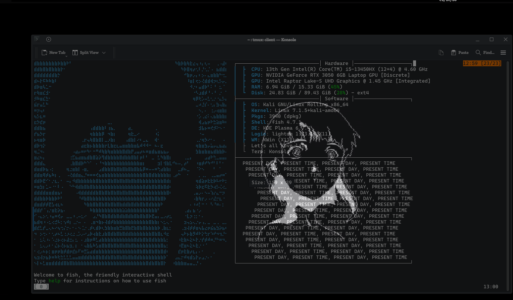

# lain-konsole-fetch

Serial Experiments Lain braille art + a fastfetch layout for Konsole. Made for fun on a free afternoon because I wanted my terminal to look like the wired. Let's all love Lain.

## What it is

- braille Lain on the left (35 rows), live info boxes on the right
- a **Hardware** box (CPU, both GPUs, RAM, disk), a **Software** box (OS, kernel, shell, DE...) and a wave of `PRESENT DAY, PRESENT TIME`
- all values come from live fastfetch modules, so it shows whatever machine you run it on
- a Konsole profile (`Lain`) with a font that can actually draw braille

## Setup I built it on

Kali Linux Rolling, KDE Plasma 6.7.4 (X11), Konsole 26.04, fish, tmux, fastfetch.
Needs the `fonts-cascadia-code` package (`sudo apt install fonts-cascadia-code`).

## Install

    git clone https://github.com/ozzymandiuz/lain-konsole-fetch
    cd lain-konsole-fetch
    ./install.sh

The script backs up your existing fastfetch config and Konsole profile before touching anything. Close Konsole before running it. Then add the lines from `fish/snippet.fish` to your fish config and open Konsole from your app menu.

## Things that bit me

- **tmux turns braille into underscores** unless it's started in UTF-8 mode. Use `exec tmux -u`, then `tmux kill-server` once.
- Konsole 26 uses the Qt6 font format. The old weight value (`50`) can get ignored, so the profile here uses `400`.
- Install the font from apt and check braille support with `fc-list ":charset=2840" family`. Plain DejaVu Sans Mono has none.
- Quick test: `echo '⣿⣷⣾⣽⣻⢿⡿⣟⠿⠛⠉'` should print dots, not lines or underscores.
- The fetch needs a window about 130 columns wide.
- If an old banner prints above the new fetch, look in `~/.config/fish/config.fish` for a leftover `echo "####..."` block and comment it out.

## Credits

The Lain art and layout come from the Serial Experiments Lain KDE rice by P3DR0K13 ([Lain-Dotfiles-Linux-KDEPlasma-](https://github.com/P3DR0K13/Lain-Dotfiles-Linux-KDEPlasma-)). This is my small fan adaptation for Konsole on Kali, not affiliated with them. All Lain imagery belongs to its respective owners.
